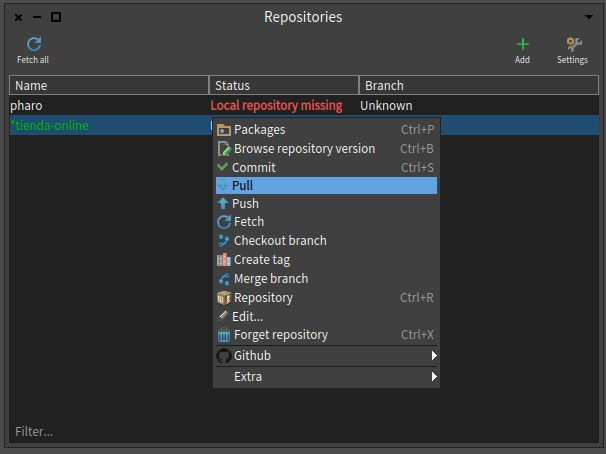
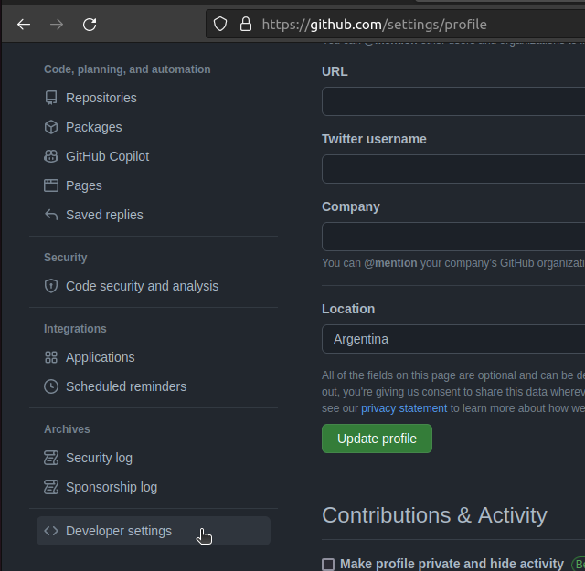
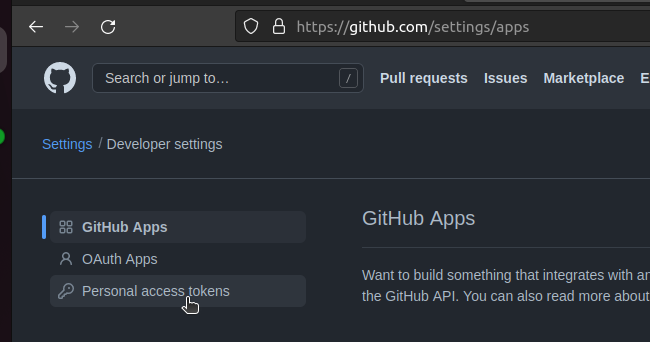
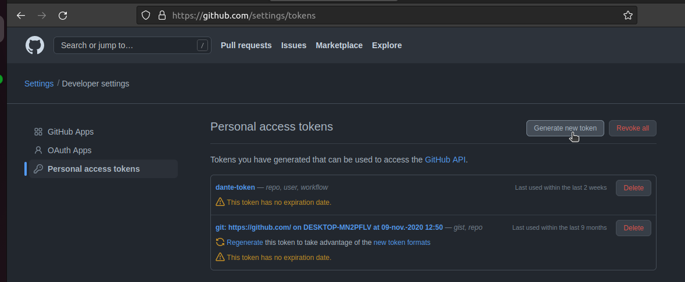
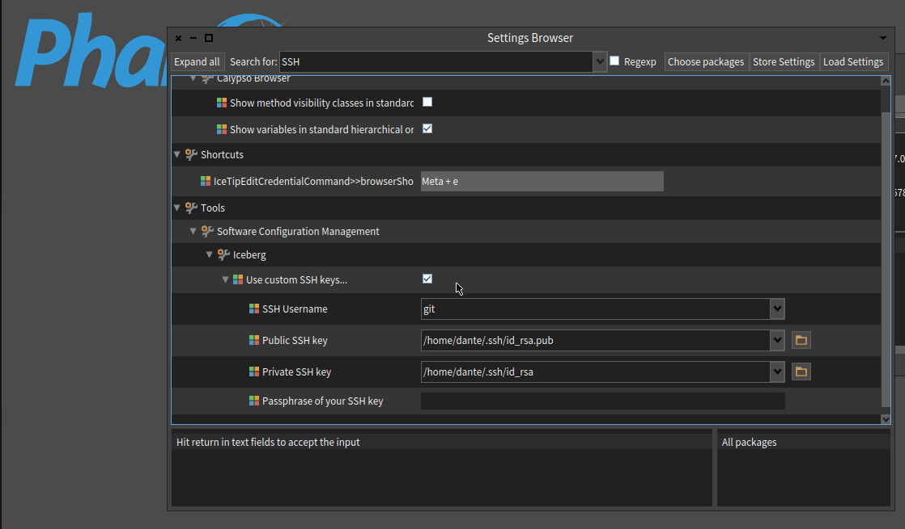

# Tutorial para usar GitHub con Pharo 

## Primera parte

Los pasos a seguir en esta primera parte se realizarán en GitHub.
Se supone que el usuario ya tiene una cuenta en la página y que
además se encuentra en ella.

El primer paso será crear un nuevo repositorio.


Daremos un nombre y una descripción a nuestro repositorio.


Por el momento, tampoco asignaremos una licencia, un README
ni un fichero de exclusión (gitignore).

Lo que haremos sera copiar el link del repositorio , preferiblemente http. (Si es usuario experimentado puede usar ssh)


## Segunda parte


Para esta parte del tutorial, iniciaremos Pharo, y nos dirigiremos a Tools->Iceberg.


>Nota:
>*Iceberg es un plugin/addon, que traen las imagenes de Pharo por defecto, es un servicio de repositorios.*

Una vez clickeado en Iceberg se abrira una ventana emergente, lo que haremos sera clickear en **+add** añadir un nuevo repositorio local.


>*el servicio de Iceberg nos da una lista de opciones que podemos usar, en caso de querer clonar un repositorio ya existente.*

Nosotros por el momento solo haremos un repositorio local.


Si hicimos todo bien, deberia figurarnos el repositorio en nuestra ventana.


Como siguiente paso haremos click derecho. y se desplegara una lista. ahi podemos interactuar con nuestro repositorio.

lo que haremos sera configurar y enlazar nuestro repositorio local con el repositorio creado en github.


Esta ventana es muy importante, en esta ventana se administran todos los commits,ramas y autores en el repositorio local. 
podemos ver que por defecto Iceberg nos crea un branch(rama) master. esto representa nuestro usuario local. lo haremos sera crear un usuario 
que pueda recibir las actualizaciones del repositorio de origin. por lo que iremos a **+add remote** 


Deberia abrirse una ventana emergente donde se nos pide 2 cosas. 

1. identificacion del branch o usuario(puede ser cualqueira)
2. la url donde se encuentra ese repositorio(es el link http guardado del paso 1).


>Nota: *si no trabajamos en equipo, es recomendable solo tener una rama denotada master, por convencion*

al aceptar los cambios posiblemente se nos pedira un usuario y contraseña, eso es referido a nuestra cuenta gitHub.
logeados con exito. Iceberg gestionara todo automaticamente, ahora si todo salio bien, notaremos cambios que antes no estaban.


### Felicitaciones, ya tienes enlazado un repositorio de Pharo, con gitHub 

## Como añadir proyectos?

lo que haremos sera dirigirnos a nuestra ventana de Icerberg, seleccionando el repositorio haremos click derecho y presionaremos en Packages.


ahora solo añadiremos nuestro package al working directory presionando en **add package** .


Listo :) ahora podremos commitear y pushear a github. simplemente apretando click derecho en el repositorio local y todo se hara automaticamente



*espero este pequeño tutorial te haya sido de utilidad*

## Apartado actualizado 2022 politicas de github y token de usuario

a partir del año 2021 github implemento un sistema de token bajo el protocolo https , esto con el fin de añadir una capa extra de seguridad, por lo tanto puede haber cosas que en este tutorial no funcionen de manera adecuada, asi que traigo las pequeñas variantes que se deben tener en cuenta a la hora de usar github . decidi separar esto en protocolo https y ssh para que decidan el que mejor les convenga 

### Https

Si utilizan este tipo de protocolo , debe configurarse unas cuestiones previas. vamos primero por Pharo 

1) Si desea hacer un clon de repositorio de github , deben cambiar el tipo de protocolo por defecto de smalltalk , esto se hace ejecutando en el playground el mensaje 

```st
Iceberg remoteTypeSelector: #httpsUrl
```

2) si tiene problemas para ingresar su usuario de github en iceberg 

Esto se debe a las nuevas politicas de github, el login ahora varia un poco de la manera tradicional. el usuario se mantiene igual, lo que cambia es la contraseña. ahora la contraseña es el token encriptado que nos provee github. 

como acceder a ese token. ir a las opciones de github 


entrar al apartado de personal acces token



Aqui vamos a generar un token 



El token generado debemos copiarlo y guardarlo, este sera nuestro password para el login de github 


## SSH

Si utiliza este protocolo, puede serle de mayor utilidad a la hora de desarrollar en smalltalk, ya que todos los permisos se gestionan mediante llaves publicas y privadas. tratare de no entrar en detalles ya que la configuracion de este tipo de protocolo es exactamente igual. la unica diferencia que debe tener en cuenta , es que una vez haya creado su llave en su sistema operativo , y  agregado la llave en github ( SSH and GPG keys) , deberia 

1) activar ssh custom key en smalltalk 



2) Clon via ssh 

 para que la funcion ssh se active, a la hora de subir un proyecto,en el paso previo de clonar el repositorio vacio en Pharo  debe clonar el repositorio en modo SSH , ESTO ES MUY IMPORTANTE, ya que de no hacerlo. no surtira efecto la configuracion previa. 

### Ventajas de SSH vs Https

1) No pide autorizacion a la hora de hacer push pulls en sus repositorios. todo se gestiona de manera automatica y solo debe preocuparse por el flujo basico de git


